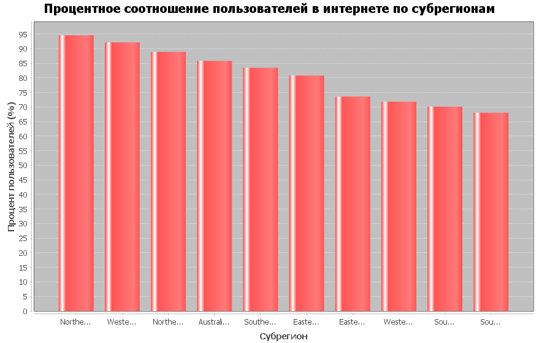

# Описание проекта
Данный проект реализует **анализ данных о странах мира с фокусом на статистике интернет-пользователей**. Проект включает парсинг **CSV-данных**, работу с базой данных **SQLite** в соответствии с **3-ей нормальной формой**, выполнение специализированных SQL-запросов и визуализацию результатов.

## Этапы работы проекта
### 1. Парсинг CSV-файла → объекты: **Country**, **Region**, **Subregion**: 
Метод **CSVParser.parseCSV()** считывает данные из файла, создает объекты всех трех типов и возвращает их через вложенный класс **ParseResult**.

### 2. Создание БД SQLite в 3НФ → таблицы Region, Subregion, Country:
**DatabaseManager** устанавливает соединение с БД и создает три таблицы в соответствии с **3-ей нормальной формой**.

### 3. Вставка данных из объектов в БД:
**insertData()** выполняет пакетную вставку данных в правильной последовательности: сначала регионы, затем субрегионы, и в конце страны.

### 4. Выполнение SQL-запросов согласно варианту задания:
**executeQueries()** выполняет три специализированных запроса:
* Процентное соотношение пользователей в интернете по субрегионам
* Страна с наименьшим количеством пользователей в Восточной Европе
* Страны с процентом пользователей от 75% до 85%
   
### 5. Визуализация данных → диаграмма процентного соотношения
**ChartGenerator** строит столбчатую диаграмму, используя JFreeChart для отображения процентного соотношения пользователей в интернете по субрегионам.

### 6. Вывод результатов в консоль
Результаты всех трех запросов форматировано выводятся в консоль с заголовками.

### 7. Закрытие соединения с БД:
Метод close() обеспечивает корректное завершение работы с базой данных, предотвращая утечки ресурсов.

## Структура проекта

```text
src/
  main/
    java/
      org/
        example/
          Main.java
          CSVParser.java
          DatabaseManager.java
          ChartGenerator.java
          Region.java
          Subregion.java
          Country.java
    resources/
      Country.csv
      pom.xml
      countries.db
```

## Процентное соотношение пользователей в интернете по субрегионам


## Страна с наименьшим кол-вом зарегистрированных в интерете пользователей в Восточной Европе.


## Страны процент зарегистрированных в интернете пользователей в которых находится в промежутке от 75% до 85%
